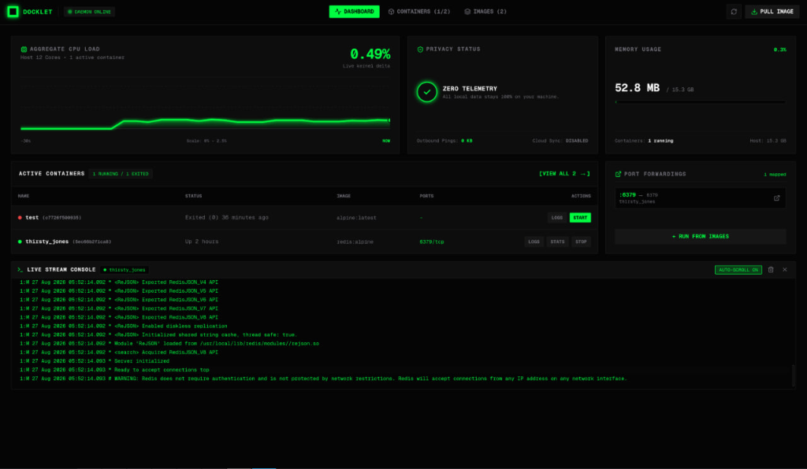
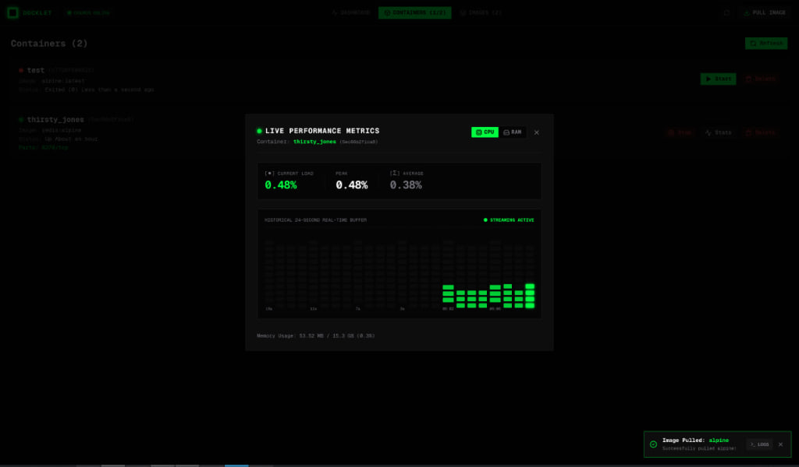
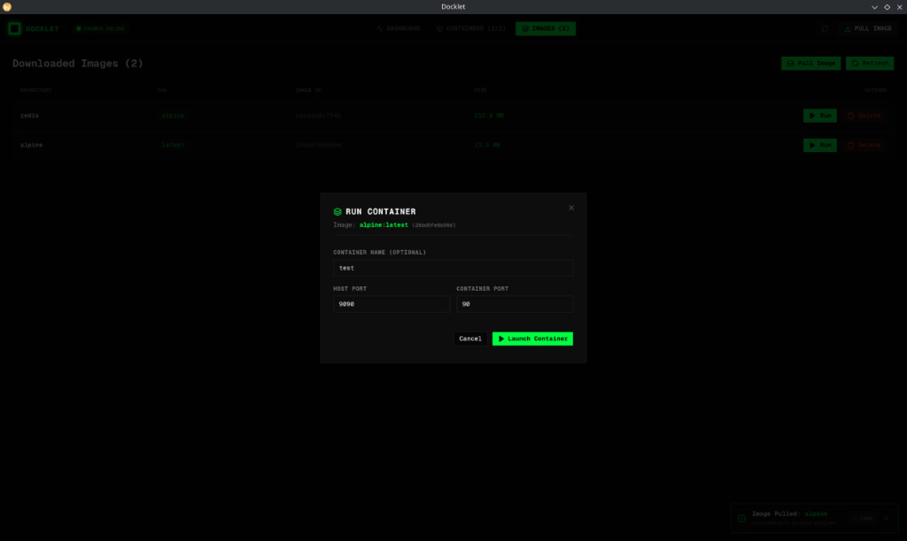

# Docklet

[](https://github.com/ruhamabek/Docklet/releases)
[](https://github.com/ruhamabek/Docklet/releases)
[](https://github.com/ruhamabek/Docklet/blob/main/LICENSE)

Docklet is a lightweight, privacy-focused desktop application for managing Docker containers and images. Built with Go, Wails v2, Next.js, TypeScript, Tailwind CSS, and Shadcn UI, Docklet provides a high-performance terminal aesthetic with real-time metrics, live log streaming, and zero cloud telemetry.



---

## Features

- Real-Time System Metrics: Live monitoring of aggregate host CPU load, active container count, and system memory consumption.
- Container Lifecycle Management: Start, stop, delete, and inspect active containers and port forwardings with a single click.
- Live Streaming Logs: Integrated bottom terminal with auto-scroll and stream management for container logs.
- Performance Inspection: Modal dialogs with real-time 24-second historical buffers for CPU and memory usage per container.
- Background Image Pulling: Pull images from Docker Hub or private registries with live layer progress, background task persistence, and cancellation support.
- Validated Container Launch: Zod-validated forms for configuring container names, host ports, and container port mappings.
- Zero Telemetry: 100% local execution with no outbound analytics, trackers, or cloud dependencies.

---

## Screenshots

### Container Performance Metrics


### Launch Container from Image


---

## Architecture

- Backend: Go 1.21+ using the official Moby Docker SDK (`github.com/moby/moby/client`) and Wails v2 for native OS windowing.
- Frontend: Next.js 15 (App Router with static export), React 19, TypeScript, Tailwind CSS, and Shadcn UI.
- Data Flow: Bi-directional RPC and event streaming via Wails runtime events (`container-stats-update`, `image-pull-progress`, `docker-event`).

---

## Prerequisites

Before building Docklet from source, ensure you have the following installed:

1. Go: Version 1.21 or higher (https://go.dev/dl/)
2. Node.js: Version 18 or higher with npm (https://nodejs.org/)
3. Docker: Docker Engine or Docker Desktop running locally (https://docs.docker.com/get-docker/)
4. Wails CLI: Install via Go:
   ```bash
   go install github.com/wailsapp/wails/v2/cmd/wails@latest
   ```
   Ensure `$(go env GOPATH)/bin` or `~/go/bin` is in your system `PATH`.

---

## System Dependencies

### Linux

#### Ubuntu / Debian (22.04 LTS, 24.04 LTS, Debian 12+)
```bash
sudo apt update
sudo apt install -y build-essential libgtk-3-dev libwebkit2gtk-4.1-dev pkg-config
```

#### Fedora / RHEL
```bash
sudo dnf install -y gcc-c++ gtk3-devel webkit2gtk4.1-devel pkgconf-pkg-config
```

#### Arch Linux
```bash
sudo pacman -S --needed base-devel gtk3 webkit2gtk-4.1 pkgconf
```

### macOS

Install Apple Command Line Tools:
```bash
xcode-select --install
```

### Windows

- Microsoft Edge WebView2 (pre-installed on Windows 10/11)
- Optional for cross-compilation from Linux: `mingw-w64`

---

## Building from Source

### 1. Clone the Repository
```bash
git clone https://github.com/ruhamabek/Docklet.git
cd Docklet
```

### 2. Install Frontend Dependencies
```bash
cd frontend
npm install
cd ..
```

### 3. Run in Development Mode
To launch the application with hot reloading for frontend and backend changes:
```bash
wails dev
```

### 4. Build for Production

#### Linux
```bash
wails build
```
The compiled executable will be located at: `build/bin/Docklet`

#### macOS
To build for Apple Silicon and Intel Macs:
```bash
# Universal binary (runs on both Intel and Apple Silicon)
wails build -platform darwin/universal

# Or architecture-specific:
wails build -platform darwin/arm64
wails build -platform darwin/amd64
```
The application bundle will be located at: `build/bin/Docklet.app`

#### Windows
```bash
wails build -platform windows/amd64
```
The Windows binary will be located at: `build/bin/Docklet.exe`

---

## Continuous Integration

Docklet includes a multi-platform GitHub Actions workflow (`.github/workflows/build.yml`) that automatically compiles standalone binaries for Linux (Ubuntu 22.04 baseline for maximum distro compatibility), macOS (Universal), and Windows (x64) on every push and release.

---

## License

This project is licensed under the MIT License. See the LICENSE file for details.
